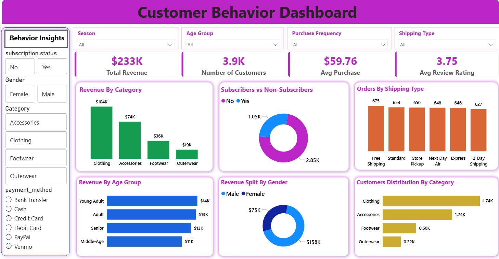
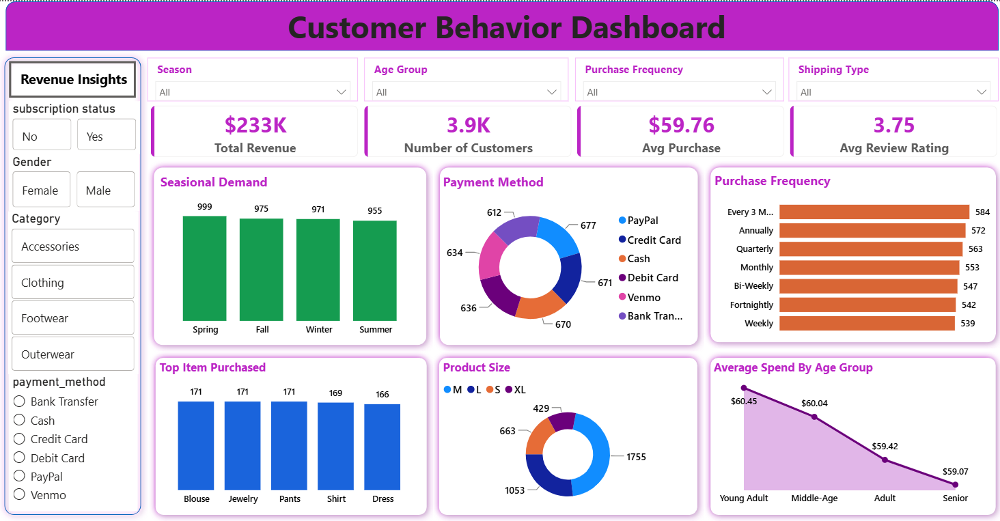

# 🛍️ Customer Shopping Behavior Analytics
Customer Shopping Behavior Analytics project using SQL, Python, and Power BI to analyze customer preferences, purchasing patterns, revenue, subscriptions, and product performance.

## 📊 Project Overview
This project analyzes customer shopping behavior using SQL, Python, and Microsoft Power BI.

The objective is to understand customer purchasing patterns, revenue performance, product 
preferences, subscription behavior, payment methods, shipping preferences, and demographic trends.

The project includes data analysis using SQL and Python along with an interactive Power BI dashboard containing Revenue Insights and Behavior Insights.

## 🛠️ Tools & Technologies
- Python
- Jupyter Notebook
- SQL
- PostgreSQL
- Microsoft Power BI
- Power Query
- DAX
- CSV

---
## 📁 Project Structure

customer-shopping-behavior-analysis/
│
├── README.md
│
├── Dashboard/
│   ├── Revenue_Insights.png
│   └── Behavior_Insights.png
│
├── PowerBI/
│   └── Customer_Dashboard.pbix
│
├── Dataset/
│   └── customer_shopping_behavior.csv
│
├── SQL/
│   └── Customer_Query.sql
│
└── Python/
    └── Customer_Shopping_Behavior.ipynb

---

## 📈 Power BI Dashboard
The dashboard provides two main views:

### Revenue Insights

Key KPIs:
- Total Revenue: $233K
- Number of Customers: 3.9K
- Average Purchase: $59.76
- Average Review Rating: 3.75

Visualizations include:
- Seasonal Demand
- Payment Method Distribution
- Purchase Frequency
- Top Items Purchased
- Product Size Distribution
- Average Spend by Age Group

### Behavior Insights

Visualizations include:
- Revenue by Category
- Subscribers vs Non-Subscribers
- Orders by Shipping Type
- Revenue by Age Group
- Revenue Split by Gender
- Customer Distribution by Category

## 🔍 SQL Analysis
The SQL analysis answers business questions related to:
- Revenue by gender
- Discount usage
- Product review ratings
- Shipping type comparison
- Subscriber vs non-subscriber spending
- Discount percentage by product
- Customer segmentation
- Top products within each category
- Repeat buyers and subscription behavior
- Revenue contribution by age group

## 🐍 Python Analysis
The Jupyter Notebook is used for customer shopping data analysis, exploration, and preparation before visualization and reporting.

## 💡 Business Questions
1. How much revenue is generated by male and female customers?
2. Do subscribers spend more than non-subscribers?
3. Which products have the highest review ratings?
4. Which shipping type has a higher average purchase amount?
5. Which products are purchased most frequently?
6. How does revenue vary across age groups?
7. What are the most popular payment methods?
8. How does customer behavior differ by category?
9. What is the distribution of customers across product categories?
10. How do purchase patterns differ by subscription status?

## 🔄 Project Workflow
Raw Data
   ↓
Data Cleaning & Preparation
   ↓
Python Analysis
   ↓
SQL Analysis
   ↓
Power BI Data Modeling
   ↓
DAX & KPIs
   ↓
Interactive Dashboard
   ↓
Business Insights

## 📸 Dashboard Preview

### Revenue Insights

### Behavior Insights

## 🎯 Skills Demonstrated
- Data Cleaning
- Data Analysis
- SQL
- Python
- Power BI
- Power Query
- DAX
- Data Visualization
- Customer Segmentation
- Revenue Analysis
- Business Intelligence
- Dashboard Development

## 📌 Project Purpose
This project was created as a data analytics portfolio project to demonstrate the ability to transform customer shopping data into meaningful business insights using SQL, Python, and Power BI.

## 👨‍💻 Author
Nitin Koshti
---

Data Analytics | SQL | Power BI | Excel | Python
---

